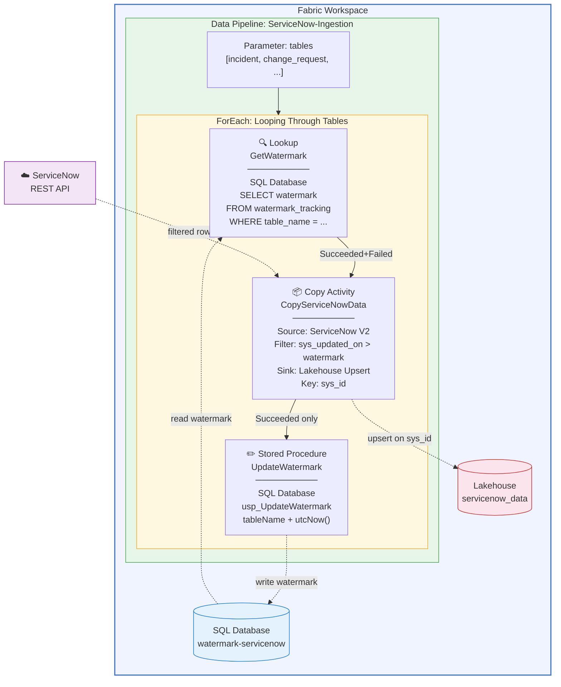

# SQL DB Watermark Pipeline — ServiceNow → Fabric Lakehouse

Incremental ingestion from ServiceNow into a Fabric Lakehouse using the **Microsoft-recommended watermark pattern**: a Fabric SQL Database tracks the last-loaded timestamp per table, and a ForEach loop drives Lookup → Copy (Upsert) → Stored Procedure for each ServiceNow table.

**No notebooks. No staging tables. No Spark compute. Three native pipeline activities per table.**

---

## Architecture Overview

```
┌─────────────────────────────────────────────────────────────────────────────┐
│                        Fabric Workspace                                     │
│                                                                             │
│  ┌──────────────┐    ┌──────────────────────┐    ┌───────────────────────┐  │
│  │  SQL Database │    │  Data Pipeline        │    │  Lakehouse            │  │
│  │  (watermark   │◄──│  ServiceNow-Ingestion  │──►│  servicenow_data      │  │
│  │   tracking)   │    │                        │    │                       │  │
│  └──────────────┘    └──────────────────────┘    └───────────────────────┘  │
│                               │                                             │
└───────────────────────────────┼─────────────────────────────────────────────┘
                                │
                                ▼
                    ┌──────────────────────┐
                    │  ServiceNow Instance  │
                    │  (REST API / V2)      │
                    └──────────────────────┘
```

### Pipeline Flow (per table, inside ForEach)

```
┌──────────────────┐     ┌─────────────────────────┐     ┌──────────────────┐
│  1. Lookup       │     │  2. Copy Activity        │     │  3. Stored Proc  │
│  GetWatermark    │────►│  Copy ServiceNow Data    │────►│  UpdateWatermark │
│                  │     │                           │     │                  │
│  Reads last      │     │  Source: ServiceNow V2    │     │  Sets watermark  │
│  watermark from  │     │  Filter: sys_updated_on   │     │  to utcNow()     │
│  SQL Database    │     │         > watermark       │     │  in SQL Database │
│                  │     │  Sink: Lakehouse Upsert   │     │                  │
│  Returns:        │     │        on sys_id          │     │  Only runs on    │
│  timestamp or    │     │                           │     │  Copy SUCCESS    │
│  1970-01-01      │     │  Creates table if new     │     │                  │
└──────────────────┘     └─────────────────────────┘     └──────────────────┘
   Succeeded+Failed              Succeeded only
```

### Dependency Chain

```
GetWatermark ──(Succeeded + Failed)──► CopyServiceNowData ──(Succeeded only)──► UpdateWatermark
```

- **Succeeded + Failed** on the Lookup ensures first runs work even if no watermark row exists yet
- **Succeeded only** on the Stored Procedure ensures the watermark only advances after data is safely written

---

## What's in This Folder

| File | Description |
|---|---|
| [01-setup-sql-database.md](01-setup-sql-database.md) | Create a Fabric SQL Database and set up the watermark table + stored procedure |
| [02-setup-pipeline.md](02-setup-pipeline.md) | Step-by-step guide to build the pipeline in Fabric Data Factory |
| [03-testing-and-validation.md](03-testing-and-validation.md) | How to test with 1 table, then scale to many |
| [04-troubleshooting.md](04-troubleshooting.md) | Common errors and fixes encountered during development |
| [pipeline-definition.json](pipeline-definition.json) | Reference pipeline JSON (blueprint, not directly importable) |

---

## Prerequisites

| Requirement | Details |
|---|---|
| **Fabric workspace** | F64 or higher capacity recommended |
| **Fabric Lakehouse** | Created in the workspace (e.g., `servicenow_data`) |
| **Fabric SQL Database** | Created in the workspace (e.g., `watermark-servicenow`) |
| **ServiceNow instance** | Developer or production instance with REST API access |
| **ServiceNow auth** | Service account with Basic authentication |
| **Workspace role** | Contributor or higher |

---

## Quick Start (5-minute version)

1. **Create the SQL Database** in your Fabric workspace → name it `watermark-servicenow`
2. **Run the SQL scripts** from [01-setup-sql-database.md](01-setup-sql-database.md) to create the watermark table and stored procedure
3. **Create a Data Pipeline** → follow [02-setup-pipeline.md](02-setup-pipeline.md)
4. **Run with 1 table first** (`incident`) → verify rows land in Lakehouse
5. **Re-run** → verify 0 rows read (incremental proof)
6. **Add more tables** to the parameter array → run again

---

## Why SQL Database (Not Lakehouse) for Watermark?

Fabric Lakehouse Lookup activities only support **Table mode** — you pick a table from a dropdown. The **T-SQL Query mode is greyed out** for Lakehouse connections. This means you cannot run:

```sql
SELECT watermark_value FROM watermark_tracking WHERE table_name = 'incident'
```

against a Lakehouse table in a Lookup activity.

A Fabric SQL Database has **full T-SQL support** in Lookup activities: query mode, `WHERE` clauses, `ISNULL`, `CONVERT`, stored procedures — everything works natively.

---

## Why This Pattern (vs. Alternatives)

| Approach | Works? | Overhead | Microsoft Pattern? |
|---|---|---|---|
| **SQL DB watermark (this)** | ✅ | Low — no Spark | ✅ Official tutorial |
| **Notebook watermark** | ✅ | High — 60s Spark cold start | ❌ Over-engineered |
| **Pipeline variables** | ❌ | N/A — lost each run | ❌ Can't persist |
| **Dataflow Gen2** | ❌ | N/A — no ServiceNow connector | ❌ Not available |
| **Full load + Upsert** | ✅ | Medium — re-reads everything | ❌ Wasteful at scale |

---

## Mermaid Architecture Diagram

Paste this into any Mermaid-compatible viewer (GitHub renders it natively):


