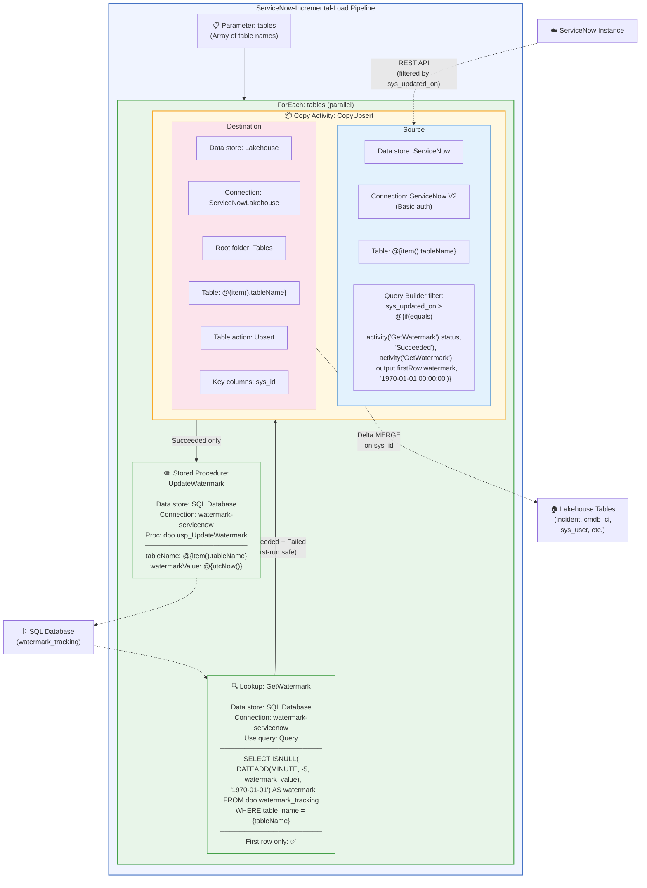

# ServiceNow Incremental Ingestion into Microsoft Fabric

Set up an incremental ingestion pipeline that loads ServiceNow ITSM data into a Fabric Lakehouse using the **native ServiceNow V2 connector** and **Copy Activity Upsert** on `sys_id`. A **Fabric SQL Database** tracks the watermark per table. No notebooks, no staging tables.

---

## Table of Contents

1. [Prerequisites](#prerequisites)
2. [Architecture](#architecture)
3. [ServiceNow Tables](#servicenow-tables)
4. [SQL Database Setup (Watermark Tracking)](#sql-database-setup-watermark-tracking)
5. [Incremental Pipeline Setup](#incremental-pipeline-setup)
   - [Step 1: Configure the Lookup (Watermark from SQL DB)](#step-1-configure-the-lookup-watermark-from-sql-db)
   - [Step 2: Configure the Copy Activity Source (ServiceNow V2)](#step-2-configure-the-copy-activity-source-servicenow-v2)
   - [Step 3: Configure the Upsert Sink](#step-3-configure-the-upsert-sink)
   - [Step 4: Update the Watermark (Stored Procedure)](#step-4-update-the-watermark-stored-procedure)
   - [Step 5: ForEach Loop for Multiple Tables](#step-5-foreach-loop-for-multiple-tables)
6. [Handling Deletes](#handling-deletes)
7. [Reference](#reference)

---

## Prerequisites

- Microsoft Fabric workspace (F64 or higher capacity recommended)
- Fabric Lakehouse created in the workspace
- **Fabric SQL Database** created in the workspace (for watermark tracking)
- ServiceNow instance with a service account (Basic authentication)
- Workspace contributor or higher role

---

## Architecture

```
SQL DB (watermark)  →  ServiceNow  →  Lakehouse  →  SQL DB (update watermark)
      ↑                    ↓               ↓               ↓
  GetWatermark     V2 connector      Upsert on         UpdateWatermark
  (read last wm)  (sys_updated_on    sys_id            (set new wm)
                   > wm − 5 min)
```

**Per-table flow inside a ForEach activity (3 activities):**

```
┌─────────────────────────┐  Succeeded   ┌──────────────────────────────────────────────┐  Succeeded  ┌─────────────────────────┐
│ Lookup: GetWatermark    │──  +  ──────▶│ Copy Activity: CopyUpsert                    │────only───▶│ Stored Proc:            │
│                         │  Failed      │ Source: ServiceNow V2 (sys_updated_on > wm)  │            │ UpdateWatermark         │
│ Read watermark_value    │  (first-run  │ Sink: Lakehouse Upsert on sys_id             │            │ Set watermark = UTC now │
│ from SQL DB − 5 min     │   safe)      │ (inserts new rows, updates changed rows)     │            │ in SQL DB               │
└─────────────────────────┘              └──────────────────────────────────────────────┘            └─────────────────────────┘
```

**Why Fabric SQL Database (not Lakehouse) for watermark tracking?**

Fabric Lakehouse Lookup activities only support **Table mode** (pick a table from a dropdown). The **T-SQL Query mode is disabled** for Lakehouse connections — you'll see the radio button greyed out with a message about updating the connection to enable query mode. This means you can't run `SELECT ... WHERE table_name = 'incident'` against a Lakehouse table in a Lookup. The SQL analytics endpoint is also not available as a data store option in the Lookup activity.

A Fabric SQL Database has full T-SQL support in Lookup activities — query mode, `WHERE` clauses, `ISNULL`, `DATEADD`, and stored procedures all work natively.

**Why this works:**
- **SQL Database stores the watermark** — fully queryable with T-SQL, no Lakehouse SQL endpoint needed.
- **Upsert on `sys_id`** is idempotent — the 5-minute overlap window may re-pull some rows, but upsert handles duplicates natively.
- **Watermark updates only on success** — if the Copy Activity fails, the watermark stays unchanged, so the next run retries the same window.
- **No staging tables, no notebooks, no dedup logic.** Three activities per table.

### Pipeline Construction Diagram



**How to build this in Fabric Data Factory:**

1. Create a new **Data Pipeline** in your workspace
2. Add a **ForEach** activity → set items to `@pipeline().parameters.tables`
3. Inside the ForEach, add a **Lookup** activity → connect to the SQL Database (see Step 1)
4. After the Lookup, add a **Copy Activity** → configure source (ServiceNow V2) and sink (Lakehouse Upsert)
5. After the Copy Activity, add a **Stored Procedure** activity → connect to the SQL Database (see Step 4)
6. Draw dependency arrows: Lookup → Copy (on **Success** and **Failure**) → Stored Procedure (on **Success** only)
7. Add a **Schedule trigger** (hourly or daily)

### Safeguards

| Safeguard | Implementation |
|---|---|
| **Watermark tracking** | SQL Database table `dbo.watermark_tracking` stores per-table watermark values |
| **Overlap window (5 min)** | Lookup subtracts 5 minutes from the stored watermark to catch late-arriving updates |
| **Upsert on `sys_id`** | Copy Activity sink handles insert/update natively — duplicates from overlap are harmless |
| **First-run handling** | If the Lookup returns no row (table not in watermark table yet), defaults to `1970-01-01`, pulling all records |
| **Watermark only updates on success** | Stored Procedure runs only when the Copy Activity succeeds — failed runs retry the same window |
| **Delete detection** | Schedule a weekly full-load reconciliation (see [Handling Deletes](#handling-deletes)) |

---

## ServiceNow Tables

Confirm the following core ServiceNow tables (or their equivalents) exist in your Lakehouse:

| ServiceNow Table | Description |
|---|---|
| `incident` | IT service disruption records |
| `cmdb_ci` | Configuration items (servers, apps, services) |
| `sys_user` | User records |
| `sys_user_group` | Support groups and teams |
| `change_request` | Change management records |
| `task` | Generic task records |
| `cmdb_rel_ci` | CI-to-CI dependency relationships |
| `kb_knowledge` | Knowledge base articles |
| `problem` | Problem management records |
| `sc_request` | Service catalog requests |

---

## SQL Database Setup (Watermark Tracking)

Create a Fabric SQL Database in your workspace (e.g., `ServiceNowWatermarkDB`). Then run the following T-SQL to create the watermark table and stored procedure:

```sql
-- Watermark tracking table
CREATE TABLE dbo.watermark_tracking (
    table_name   NVARCHAR(128) PRIMARY KEY,
    watermark_value DATETIME2    NOT NULL DEFAULT '1970-01-01 00:00:00'
);

-- Seed rows for each table you plan to ingest
INSERT INTO dbo.watermark_tracking (table_name) VALUES
    ('incident'),
    ('cmdb_ci'),
    ('sys_user'),
    ('sys_user_group'),
    ('change_request'),
    ('cmdb_rel_ci');
GO

-- Stored procedure to update watermark after a successful copy
CREATE PROCEDURE dbo.usp_UpdateWatermark
    @tableName NVARCHAR(128),
    @watermarkValue NVARCHAR(50)
AS
BEGIN
    MERGE dbo.watermark_tracking AS target
    USING (SELECT @tableName AS table_name, CAST(@watermarkValue AS DATETIME2) AS watermark_value) AS source
    ON target.table_name = source.table_name
    WHEN MATCHED THEN UPDATE SET watermark_value = source.watermark_value
    WHEN NOT MATCHED THEN INSERT (table_name, watermark_value) VALUES (source.table_name, source.watermark_value);
END;
GO
```

---

## Incremental Pipeline Setup

### Step 1: Configure the Lookup (Watermark from SQL DB)

Add a **Lookup Activity** named `GetWatermark` that reads the watermark from the SQL Database:

**Settings:**
- **Data store:** SQL Database
- **Connection:** Select your `ServiceNowWatermarkDB`
- **Use query:** Query
- **Query** (Add dynamic content):

```sql
SELECT ISNULL(
    DATEADD(MINUTE, -5, watermark_value),
    '1970-01-01 00:00:00'
) AS watermark
FROM dbo.watermark_tracking
WHERE table_name = '@{item().tableName}'
```

- **First row only:** Yes

**Dependency configuration:**
- Set the **Copy Activity's dependency** on this Lookup to **Succeeded + Failed** (not just Succeeded)
- This ensures the pipeline still runs on first execution even if the Lookup returns no rows
- If the Lookup fails (e.g., table name not seeded yet), the Copy Activity's source expression defaults to `1970-01-01`, pulling all records
- The `-5 MINUTE` overlap catches late-arriving updates; upsert makes duplicates harmless

### Step 2: Configure the Copy Activity Source (ServiceNow V2)

In the Copy Activity **Source** tab:

1. **Data store:** Select **ServiceNow**.
2. **Connection:** Select an existing connection or create a new one:
   - **Server URL:** `https://<instance>.service-now.com`
   - **Authentication:** Basic
   - **Username / Password:** ServiceNow service account credentials
3. **Table:** When inside a ForEach, use dynamic content: `@{item().tableName}`. For a single-table test, select the table directly (e.g., `incident`).
4. **Query Builder** (under Advanced): Add dynamic content to filter on `sys_updated_on > watermark`. The expression below handles both the success case (watermark found) and the failure case (first run, no row):

```json
{
    "type": "Binary",
    "operators": [">"],
    "operands": [
        {
            "type": "Field",
            "value": "sys_updated_on"
        },
        {
            "type": "Constant",
            "value": "@{if(equals(activity('GetWatermark').status, 'Succeeded'), activity('GetWatermark').output.firstRow.watermark, '1970-01-01 00:00:00')}"
        }
    ]
}
```

### Step 3: Configure the Upsert Sink

In the **Destination** tab:
- **Data store:** Lakehouse
- **Connection:** Select your Lakehouse (e.g., `ServiceNowLakehouse`)
- **Root folder:** Tables
- **Table:** Use dynamic content `@{item().tableName}` when inside a ForEach, or select the table directly for a single-table test
- **Table action:** **Upsert**
- **Key columns:** `sys_id`

> **Note:** If the table doesn't exist in the Lakehouse yet, the first Copy Activity run creates it automatically from the ServiceNow schema.

The Copy Activity handles the Delta MERGE internally — matching rows by `sys_id` are updated, new rows are inserted.

### Step 4: Update the Watermark (Stored Procedure)

After the Copy Activity, add a **Stored Procedure** activity named `UpdateWatermark`:

- **Data store:** SQL Database
- **Connection:** Select your `ServiceNowWatermarkDB`
- **Stored procedure name:** `dbo.usp_UpdateWatermark`
- **Parameters:**
  - `tableName`: `@{item().tableName}` (String)
  - `watermarkValue`: `@{utcNow('yyyy-MM-dd HH:mm:ss')}` (String — not DateTime; SQL Server handles the implicit conversion to DATETIME2)
- **Dependency:** Runs only when `CopyUpsert` **succeeds** (do NOT add a Failed condition here)

This ensures the watermark only advances when data was successfully copied. If the Copy Activity fails, the Stored Procedure is skipped and the watermark stays at its previous value — the next pipeline run retries from the same window.

**Summary of dependency chain:**

```
GetWatermark ──(Succeeded + Failed)──▶ CopyUpsert ──(Succeeded only)──▶ UpdateWatermark
```

### Step 5: ForEach Loop for Multiple Tables

Wrap the Lookup → Copy → Stored Procedure pattern in a **ForEach** activity with a pipeline parameter:

```json
"parameters": {
    "tables": {
        "type": "Array",
        "defaultValue": [
            { "tableName": "incident" },
            { "tableName": "cmdb_ci" },
            { "tableName": "sys_user" },
            { "tableName": "sys_user_group" },
            { "tableName": "change_request" },
            { "tableName": "cmdb_rel_ci" }
        ]
    }
}
```

- **Incremental key:** `sys_updated_on` (datetime) from ServiceNow
- **Refresh frequency:** Match your SLA requirements (hourly for P1 visibility, daily for reporting)
- **Schedule:** Add a pipeline trigger (Scheduled or Tumbling window)

See [pipelines/servicenow-incremental-load.json](pipelines/servicenow-incremental-load.json) for the full pipeline definition.

---

## Handling Deletes

A `sys_updated_on` watermark captures inserts and updates but **does not detect hard deletes** in ServiceNow. Fabric's Copy Job CDC feature supports delete detection for some database sources (Azure SQL, Snowflake, etc.) but not ServiceNow.

**Recommended approach for delete detection:**
- Schedule a **weekly full-load reconciliation** pipeline that pulls the full table and identifies records present in Fabric but missing from ServiceNow
- Alternatively, use ServiceNow's audit log or business rules to track deletes if that's a hard requirement

For most ITSM analytics scenarios, incremental inserts/updates with periodic full reconciliation is sufficient.

---

## Reference

- [Configure ServiceNow in a copy activity](https://learn.microsoft.com/en-us/fabric/data-factory/connector-servicenow-copy-activity) — native connector docs, Query Builder syntax, expression parameter format
- [pipelines/servicenow-incremental-load.json](pipelines/servicenow-incremental-load.json) — pipeline JSON definition
